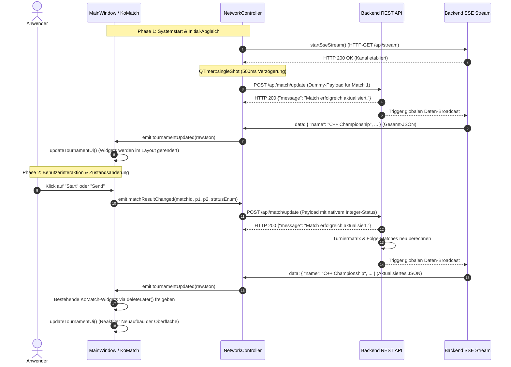

```mermaid
sequenceDiagram
    autonumber
    actor User as Anwender
    participant GUI as MainWindow / KoMatch
    participant NC as NetworkController
    participant API as Backend REST API
    participant SSE as Backend SSE Stream

    Note over GUI, NC: Phase 1: Systemstart & Initial-Abgleich
    NC->>SSE: startSseStream() (HTTP-GET /api/stream)
    SSE-->>NC: HTTP 200 OK (Kanal etabliert)
    
    Note over NC: QTimer::singleShot (500ms Verzögerung)
    NC->>API: POST /api/match/update (Dummy-Payload für Match 1)
    API-->>NC: HTTP 200 {"message": "Match erfolgreich aktualisiert."}
    API-->>SSE: Trigger globalen Daten-Broadcast
    SSE->>NC: data: { "name": "C++ Championship", ... } (Gesamt-JSON)
    NC->>GUI: emit tournamentUpdated(rawJson)
    GUI->>GUI: updateTournamentUi() (Widgets werden im Layout gerendert)

    Note over User, GUI: Phase 2: Benutzerinteraktion & Zustandsänderung
    User->>GUI: Klick auf "Start" oder "Send"
    GUI->>NC: emit matchResultChanged(matchId, p1, p2, statusEnum)
    NC->>API: POST /api/match/update (Payload mit nativem Integer-Status)
    API-->>NC: HTTP 200 {"message": "Match erfolgreich aktualisiert."}
    API->>API: Turniermatrix & Folge-Matches neu berechnen
    API-->>SSE: Trigger globalen Daten-Broadcast
    SSE->>NC: data: { "name": "C++ Championship", ... } (Aktualisiertes JSON)
    NC->>GUI: emit tournamentUpdated(rawJson)
    GUI->>GUI: Bestehende KoMatch-Widgets via deleteLater() freigeben
    GUI->>GUI: updateTournamentUi() (Reaktiver Neuaufbau der Oberfläche)
```