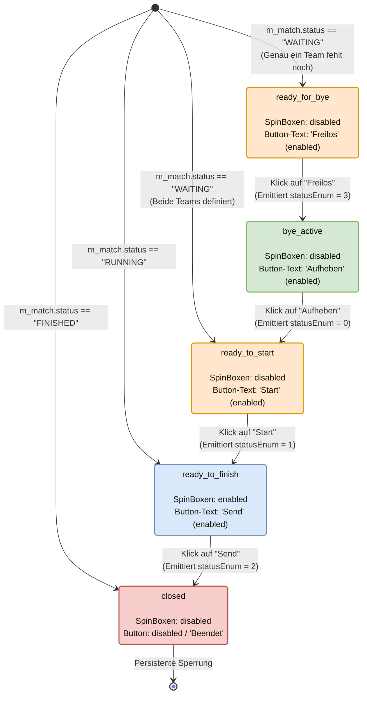

```mermaid
stateDiagram-v2
    [*] --> ready_to_start : m_match.status == "WAITING"<br/>(Beide Teams definiert)
    [*] --> ready_for_bye : m_match.status == "WAITING"<br/>(Genau ein Team fehlt noch)
    [*] --> ready_to_finish : m_match.status == "RUNNING"
    [*] --> closed : m_match.status == "FINISHED"

    state "ready_to_start<br/><br/>SpinBoxen: disabled<br/>Button-Text: 'Start' (enabled)" as ready_to_start
    state "ready_for_bye<br/><br/>SpinBoxen: disabled<br/>Button-Text: 'Freilos' (enabled)" as ready_for_bye
    state "ready_to_finish<br/><br/>SpinBoxen: enabled<br/>Button-Text: 'Send' (enabled)" as ready_to_finish
    state "bye_active<br/><br/>SpinBoxen: disabled<br/>Button-Text: 'Aufheben' (enabled)" as bye_active
    state "closed<br/><br/>SpinBoxen: disabled<br/>Button: disabled / 'Beendet'" as closed

    ready_to_start --> ready_to_finish : Klick auf "Start"<br/>(Emittiert statusEnum = 1)
    ready_for_bye --> bye_active : Klick auf "Freilos"<br/>(Emittiert statusEnum = 3)
    
    bye_active --> ready_to_start : Klick auf "Aufheben"<br/>(Emittiert statusEnum = 0)
    ready_to_finish --> closed : Klick auf "Send"<br/>(Emittiert statusEnum = 2)
    
    closed --> [*] : Persistente Sperrung

    style ready_to_start fill:#ffe6cc,stroke:#d79b00,stroke-width:2px
    style ready_for_bye fill:#ffe6cc,stroke:#d79b00,stroke-width:2px
    style ready_to_finish fill:#dae8fc,stroke:#6c8ebf,stroke-width:2px
    style bye_active fill:#d5e8d4,stroke:#82b366,stroke-width:2px
    style closed fill:#f8cecc,stroke:#b85450,stroke-width:2px
```